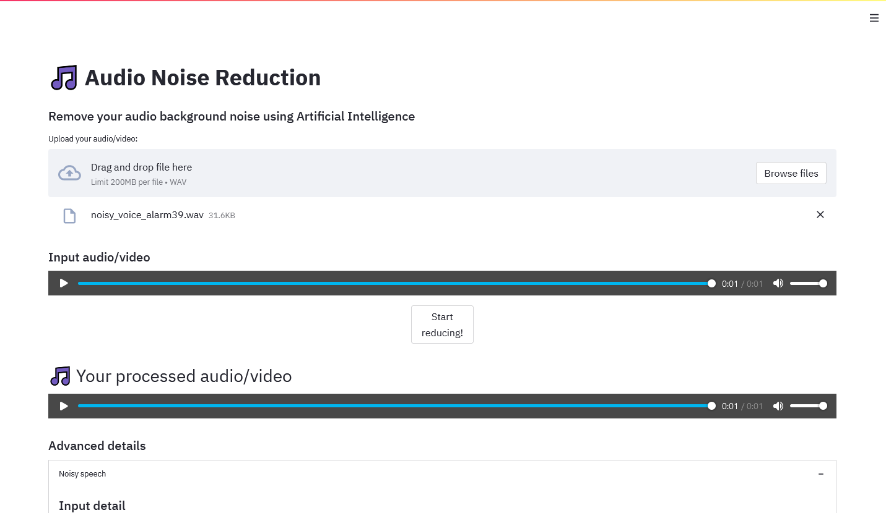

# Vietnamese Speech-enhancement with Wave U-net

<a href="https://wandb.ai/nmd2000/Speech-enhancement/"></a>

*In processing* <a href="#"></a> 


Table of Contents
================
* [Abstract](#abstract)
* [Dataset](#dataset)
* [Training](#training)
* [Result](#result)
* [Deployment](#deployment)
* [Reference](#reference)

Abstract
========
Speech enhancement is the task of improving the intelligibility and quality of a speech signal that may have been corrupted with noise or distortion, causing loss of intelligibility or quality and compromising its effectiveness in communication.

The gif below represent the concept of speech enhancement, where the input audio has been processed to reduce the signal which corresponding to the noise.


*Source: Vincent Belz [[1]](#1)*

This repository is our assignment for Course: Speech Processing (INT3411 20), where we attempt to use U-net [[2]](#2) for Speech Enhencement task and deploy a simple web application.
 
Dataset
=======

Audios have many different ways to be represented, going from raw time series to time-frequency decompositions. By representing with Spectrogram which consist of 2D images representing sequences of Short Time Fourier Transform (STFT) with time and frequency as axes, and brightness representing the strength of a frequency component at each time frame, the input of the model will be noisy voice spectrogram and the grouth truth will be clean voice spectrogram. Therefore, the UNet will learn how to segment the clean voice region inside noisy voice spectrogram (fig above).


**The clean voices** were approximately 10 hours of reading Vietnamese articles by us, student of Speech Processing Course at UET. 

**The environmental noise** were gathered from ESC-50 dataset [[3]](#3). However, we only focus on 20 classes which we believe are the most relevant to daily environmental noise. These classes are: 

|                 |   |             |   |                  |   |
|-----------------|---|-------------|---|------------------|---|
| vacuum cleaner  |   | engine      |   | keyboard typing  |  |
| fireworks       |   | mouse click |   | footsteps        |   |
| clapping        |  | clock alarm |   | car horn         |   |
| door wood knock |   | wind        |   | drinking sipping |   |
| washing machine |  | rain        |   | rooster          |   |
| snoring         |  | breathing   |   | toilet flush     |   |
| clock tick      |   | laughing    |   |                  |   |


We used public source by Vincent Belz [[1]](#1) to transform the datasets, from audios to spectrograms. Audios were sampled at 8kHz and we extracted windows slighly above 1 second. Noises have been blended to clean voices with a randomization of the noise level (between 20% and 80%). 

We publish our dataset as `Artifact` in this project worksplace at Weight&Bias (WB). We highly recommend to take a look what we've done at WB:

<a href="https://wandb.ai/nmd2000/Speech-enhancement/"></a>

Training
========

Result
======


Deployment
=========
To build a simple web application for demonstrate, we are using **Streamlit**, which is amazing tool for guys who don't know much about *html, css and so on*. With **Streamlit**, we can code our back-end with Python, which is very cool and easy to get started with.

To install **Streamlit** and orther dependencies, run:
```
$ pip install -r requirements.txt
```

To run app **Streamlit**, run:
```
$ streamlit run app.py
```

After that, if you see the same thing as in this video, you are go to go.
[](https://youtu.be/kKOSrEUSsVc)


Team member
===========
Dung Nguyen Manh: 
- :octocat: [manhdung20112000](https://github.com/manhdung20112000)  
- :email: [manhdung20112000@gmail.com](mailto:manhdung20112000@gmail.com)

Nguyen Phuc Hai: 
- :octocat: [HaiNguyen2903](https://github.com/hainguyen2903) 


Reference
============
<a id="1">[1]</a> 
Vincent Belz, "Speech-enhancement". Github:https://github.com/vbelz/Speech-enhancement.

<a id="2">[2]</a> 
Jansson, A., Humphrey, E., Montecchio, N., Bittner, R., Kumar, A., & Weyde, T. (2017). Singing voice separation with deep u-net convolutional networks.

<a id="3">[3]</a> 
Karol J. Piczak. 2015. ESC: Dataset for Environmental Sound Classification. In Proceedings of the 23rd ACM international conference on Multimedia (MM '15). Association for Computing Machinery, New York, NY, USA, 1015–1018. DOI:https://doi.org/10.1145/2733373.2806390

<a id="4">[4]</a> 
Grais, E. M., & Plumbley, M. D. (2017, November). Single channel audio source separation using convolutional denoising autoencoders. In 2017 IEEE global conference on signal and information processing (GlobalSIP) (pp. 1265-1269). IEEE.


