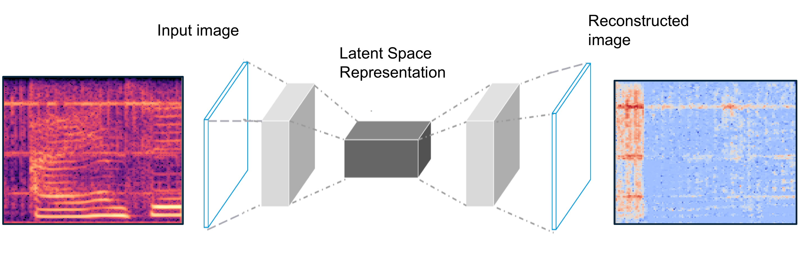

# Vietnamese Speech-enhancement with Wave U-net

Table of Contents
================
* [Abstract](#abstract)
* [Dataset](#dataset)
* [Deployment](#deployment)
* [Reference](#reference)

Abstract
========
Speech enhancement is the task of improving the intelligibility and quality of a speech signal that may have been corrupted with noise or distortion, causing loss of intelligibility or quality and compromising its effectiveness in communication.

The gif below represent the concept of speech enhancement, where the input audio has been processed to reduce the signal which corresponding to the noise.

*Source: Vincent Belz [[4]](#4)*

This repository is our assignment for Course: Speech Processing (INT3411 20), where we attempt to use U-net [[1]](#1) for Speech Enhencement task and deploy a simple web application.
 
Dataset
=======

Audios have many different ways to be represented, going from raw time series to time-frequency decompositions. By representing with Spectrogram which consist of 2D images representing sequences of Short Time Fourier Transform (STFT) with time and frequency as axes, and brightness representing the strength of a frequency component at each time frame, the input of the model will be noisy voice spectrogram and the grouth truth will be clean voice spectrogram. Therefore, the UNet will learn how to segment the clean voice region inside noisy voice spectrogram (fig above).

<!-- To create the dataset for training, we composed  -->

Deployment
=========
In progress ...

Team member
===========
Dung Nguyen Manh: 
- :octocat: [manhdung20112000](https://github.com/manhdung20112000)  
- :email: [manhdung20112000@gmail.com](mailto:manhdung20112000@gmail.com)

Nguyen Phuc Hai: 
- :octocat: [HaiNguyen2903](https://github.com/hainguyen2903) 

Reference
============
<a id="1">[1]</a> 
Jansson, A., Humphrey, E., Montecchio, N., Bittner, R., Kumar, A., & Weyde, T. (2017). Singing voice separation with deep u-net convolutional networks.

<a id="2">[2]</a> 
Grais, E. M., & Plumbley, M. D. (2017, November). Single channel audio source separation using convolutional denoising autoencoders. In 2017 IEEE global conference on signal and information processing (GlobalSIP) (pp. 1265-1269). IEEE.

<a id="3">[3]</a> 
Karol J. Piczak. 2015. ESC: Dataset for Environmental Sound Classification. In Proceedings of the 23rd ACM international conference on Multimedia (MM '15). Association for Computing Machinery, New York, NY, USA, 1015–1018. DOI:https://doi.org/10.1145/2733373.2806390

<a id="4">[4]</a> 
Vincent Belz, "Speech-enhancement". Github:https://github.com/vbelz/Speech-enhancement.
